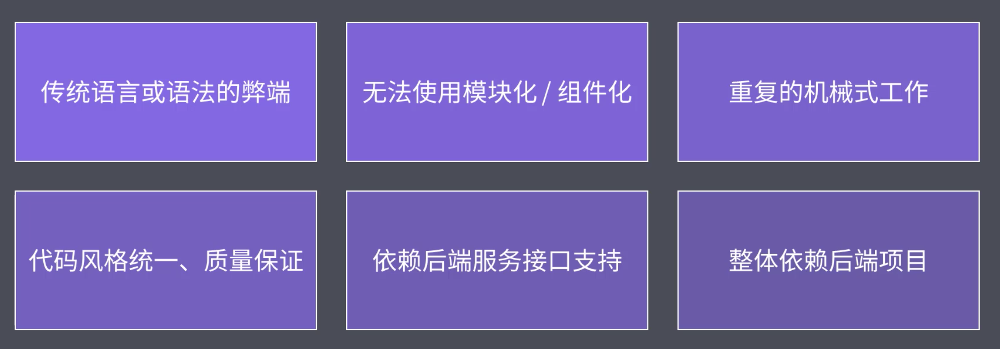
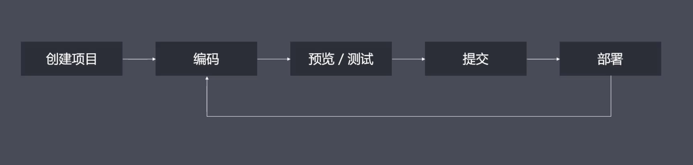
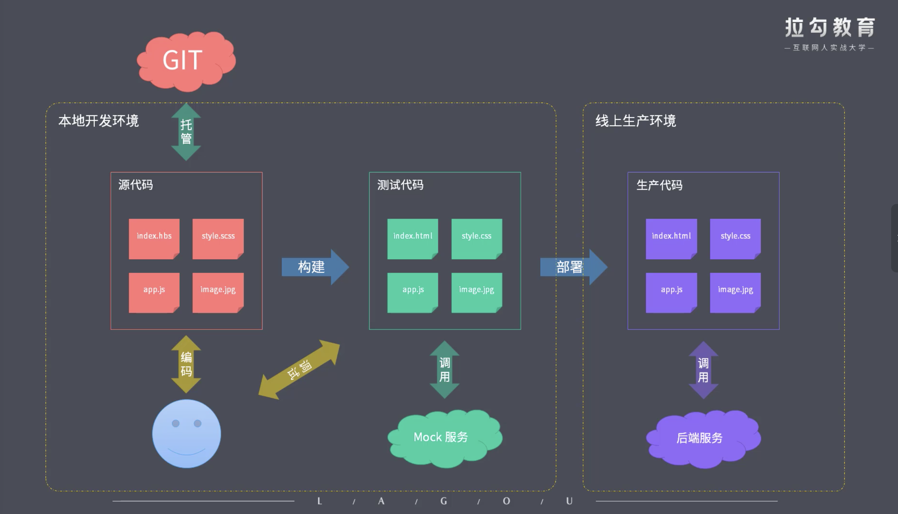

### 工程化概述
#### 1. 工程化的定义和主要解决问题
- 概念：是指遵循一定的标准和规范，通过工具提高效率降低成本的一种手段
- 面临的问题：技术是为了解决问题而存在的
  - 想要使用es6+ 新特性， 但存在兼容问题
  - 想要使用less, scss等预编译语言增强css的的编程性，但是运行环境不能直接支持
  - 想要使用模块化、组件化， 运行环境不能直接支持
  - 部署时需要手动压缩代码及资源文件，并需要手动上传服务器
  - 多人协作开发，无法硬性规定代码风格
  - 功能开发需要等待后端接口完成才可以继续开发

  


#### 2. 工程化的表现
一切以提高效率、降低成本、质量保证为目的的手段都属于工程化

- 创建项目: 使用脚手架工具自动帮我们完成基础结构搭建
- 编码: 格式化代码、校验代码风格、编译/构建/打包
- 预览、测试: HMR热更新优化开发体验、 Mock数据、 编译后通过Source Map定位源代码错误的位置
- 提交: git hooks自动化检查代码
- 部署: CI/CD  自动化发布


#### 3. 工程化 ≠ 某个工具
工程化不等于某个工具，工程化的核心是对项目的一种整体规划或者架构，工具只是来帮我们落地实现这种规划架构的一种手段。



#### 4. 工程化与node (Powered by Node.js)


### 脚手架工具
脚手架工具的本质： 创建项目基本结构， 提供了项目规范和约定
通常我们在去开发相同类型的项目时都会有一些相同的约定，其中包括：
- 相同的组织结构
- 相同的开发范式
- 相同的模块依赖
- 相同的工具配置
- 相同的基础代码
这样一来，就会出现，当我们去搭建新项目时有大量的重复工作要做，脚手架工具就是去用来解决这一问题的。我们可以通过脚手架工具去快速搭建特定类型的项目骨架，基于这个骨架完成后续的开发工作。


#### 1. 常用的脚手架工具
+ 为特定项目类型服务,根据信息创建对应的项目基础结构，一般只适用于自身服务的框架
  + react: cra
  + vue: vue-cli
  + angular: angular-cli
+ 通用型项目脚手架工具
  + yeoman
+ 用于在项目开发过程中创建特定类型的文件，例如创建组件/模板所需要的文件
  + plop


#### 2. Yeoman脚手架工具
+ 概述：
  + 一款用于创造现代化web应用的脚手架工具，更像是一个运行平台，可以搭配任何的generator创建任何类型的项目

+ 用法
  + 安装yeoman 
  ```
  yarn global add yo
  ```
  + 安装对应的 generator 
  ```
  yarn global add generator-node
  ```
  + 通过yo运行generator
  ```
  cd path/to/project-dir
  mkdir my-module
  yo node
  ```
+ 步骤
  - 明确需求
  - 找到合适的 Generator
  - 全局范围安装找到的 Generator
  - 通过 Yo 运行对应的 Generator
  - 通过命令行交互填写选项
  - 生成你所需要的项目结构

#### 3.基于 Yeoman 搭建自己的脚手架
- 创建工作目录
  ```
    mkdir generator-sample
    cd ./generator-sample
  ```
- 初始化项目中的package.json
  ```
    yarn init
  ```
- 添加 yeoman-generato 模块
  ```
    yarn add yeoman-generator
  ```
- 创建generators基本结构 ----- generators/app/index.js
  - 此文件为generator的核心入口
  - 需要导出一个继承自yeoman generator 的类型
  - Yeoman Generator在工作时会自动调用我们在此类型中定义的一些生命周期方法
  ```js
    // 案例
    const Generator = require('yeoman-generator')
    module.exports = class extends Generator {
      prompting() {
        // 接收用户输入，询问用户时会调用此方法
        return this.prompt([
          {
            type: 'input',
            name: 'title',
            message: 'Your project name',
            default: this.appname
          },
          {
            type: 'input',
            name: 'success',
            message: '是否确认成功?',
            default: true
          }
        ])
        .then(answers => {
          // answers = {title: '用户输入的值'}
          this.answers = answers
        })
      }
      writing() {
        // 在项目目录中写入文件
        // this.fs.write(
        //   this.destinationPath('sample.txt'),
        //   Math.random().toString()
        // )


        const tmpl = this.templatePath('foo.txt')
        const output = this.destinationPath('foo.txt')
        console.log('===>', this.answers);

        const context = this.answers
        this.fs.copyTpl(tmpl,output,context)
      }
    }
  ```
- 链接模块
  ``` yarn link ```
- 创建新的目录测试
  ``` 
    cd ..
    mkdir my-proj
    cd ./my-proj
  ```
- 输入命令 yo sample， 执行writing方法， 生成sampla.txt文件
  ```
    yo sample
  ```
- 发布generator  就是去发布npm包
  1) 先提交git
  ``` 
    git init
    git status
    git add .
    git commit -m '初始化'
    git remote add origin [仓库地址]
    git push -u origin master
  ```
  2) 发布模块
  ```
    npm login
    npm publish
  ```

- 发布了一个generator脚手架，包名generator-nmk-vue， git地址为https://github.com/niumkiki0912/generator-nmk-vue.git


 


